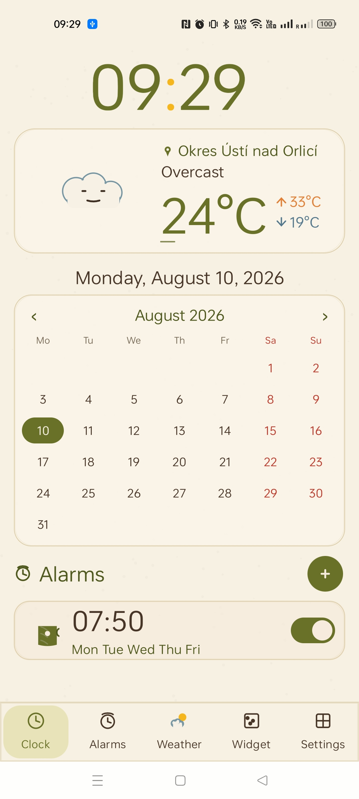
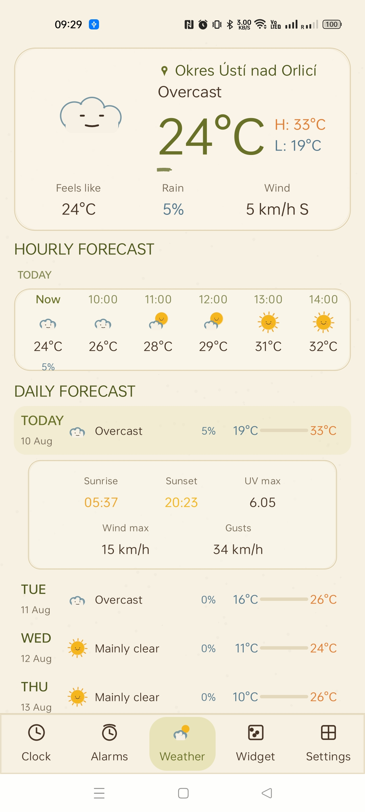
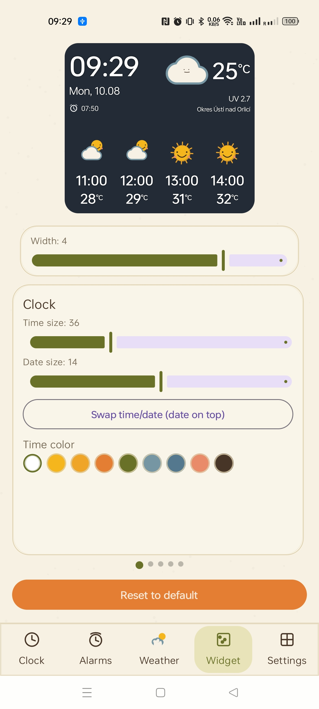
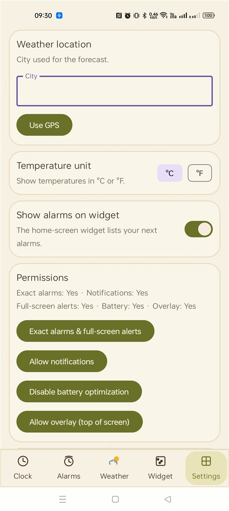
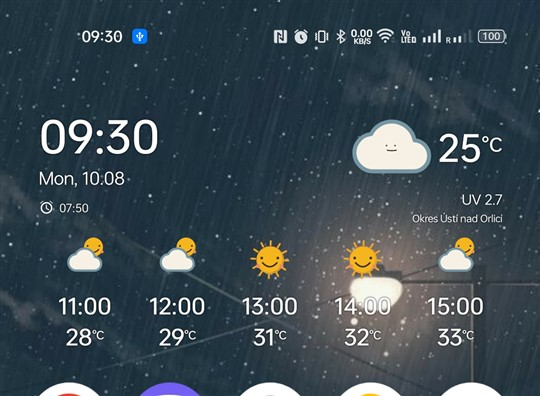

# BobrClockWeatherAlarm

A deliberately small Android clock/date/weather widget with reliable recurring alarms.

## Screenshots

| Clock Tab | Weather Tab | Widget Editor | Settings | Widget w5 |
|-----------|-------------|---------------|----------|-----------|
|  |  |  |  |  |

## Widget sizes

| Name | Grid | Min width | Hourly forecast | Features |
|------|------|-----------|-----------------|----------|
| w2 | 2×1 | 118 dp | 2 hours | Time, date, alarm, temp + icon, UV |
| w3 | 2×2 | 118 dp | 3 hours | Time, date, alarm, temp + icon, UV |
| w4 | 3×2 | 185 dp | 4 hours | Time, date, alarm, temp + icon, UV, location |
| w5 | 4×2+ | 252 dp | 5 hours | Time, date, alarm, temp + icon, UV, location |

All sizes: `maxHeight ≥ 65 dp → hourly shown`, `compact = false`.

## Design goals

- No persistent clock process: the launcher renders `TextClock`.
- No continuous location: uses the device's last known location (passive/GPS/cell), or user-set coordinates.
- Weather runs briefly on a user-selected 10-minute to 12-hour interval using `JobScheduler`; the default is one hour.
- No ads, analytics, trackers, or third-party runtime libraries.
- The time/day/song editor appears only after **Add alarm** or **Edit**.
- Multiple alarms support selected weekdays and a separate user-selected song.
- Alarms use `AlarmManager.setAlarmClock`, a foreground media-playback service, a full-screen ringing activity with Stop and 5-minute Snooze, vibration, and boot rescheduling.
- Minimum Android 8.0; target Android 16.

## Features

- **Clock tab** – large clock, current weather card (up/down arrows for high/low temp), month calendar, alarm list.
- **Weather tab** – daily details with hourly temperature graph, UV index, wind speed, sunrise/sunset.
- **Alarms tab** – add/edit/delete alarms, per-day scheduling, custom alarm sounds. (Planned: merge into Clock tab.)
- **Widget editor** – per-width config for clock/date/temp text sizes, icon size, UV, location, hourly forecast toggle; **Save/Load backup** buttons.
- **Hourly forecast** – shows the next 2–5 hours depending on widget width; rolls over past midnight correctly.
- **Alarm icon** – alarm clock icon + times shown under the date on the widget.
- **Alarm in silent mode** – option to raise volume and play alarm even when the phone is in silent/DND mode.
- **12/24h time format** – follows system setting by default, with optional override in settings.
- **Widget tap** – tap top-left to open app on Weather tab; top-right or elsewhere refreshes weather.
- **Settings backup** – Save/Load backup, Reset to defaults.

## Expected memory

Measured on a 4 GB Realme phone (Android 16):

| State | PSS | RSS |
|-------|-----|-----|
| Closed (force-stopped) | 0 MB | 0 MB |
| Background (cached) | ~111 MB | ~185 MB |
| Foreground (idle) | ~123 MB | ~188 MB |

The app normally has no process while idle: when closed, it uses zero memory — the widget renders via `TextClock` and alarms live in the system's `AlarmManager`, both without an app process. A cached background process (after closing the app normally) uses ~111 MB PSS and is reclaimed by the system under memory pressure. Device firmware and Android version affect these figures.

## Build

```powershell
.\gradlew.bat assembleDebug
```

The debug APK is written to `app/build/outputs/apk/debug/app-debug.apk`.

## Install via ADB

```powershell
adb install -r app\build\outputs\apk\debug\app-debug.apk
```

## Planned

- **Multilingual** – follow Android system language with optional override.
- Merge Alarms tab into Clock tab.
- **More tab** – app version, branch, and log viewer.
- **Autoclear log** lines older than 3 days.

## Alarm reliability checklist

1. Open the app and allow notifications.
2. Tap **Review alarm permissions** and allow exact alarms and full-screen alarms.
3. Disable battery optimization for Bobr Clock in the phone's app battery settings.
4. Use **Test alarm in 10 seconds**, lock the phone, and confirm sound, vibration, and the full-screen alarm.
5. Reboot once and confirm the alarms remain listed.

Realme/OPlus firmware can aggressively restrict third-party alarm apps. Exact alarm and notification permissions must remain enabled.

## Weather

Uses a postcode (resolved via Open-Meteo geocoding) or the device's last known location — no active tracking.

## License

Open source. See source files for details.
